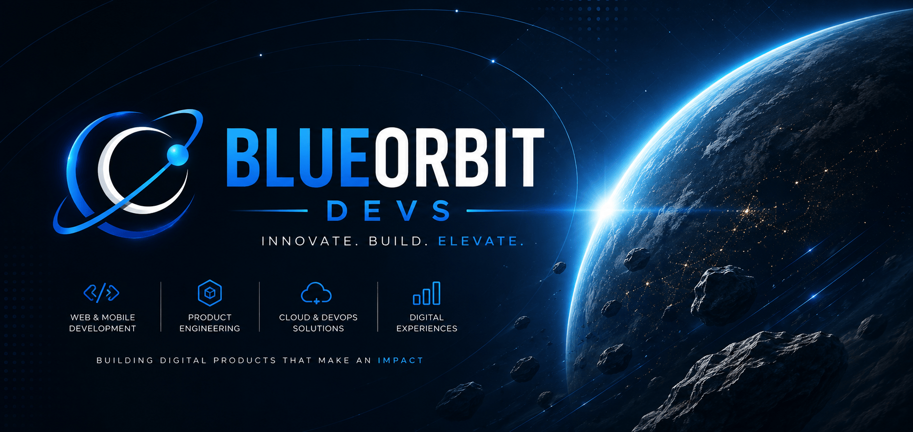
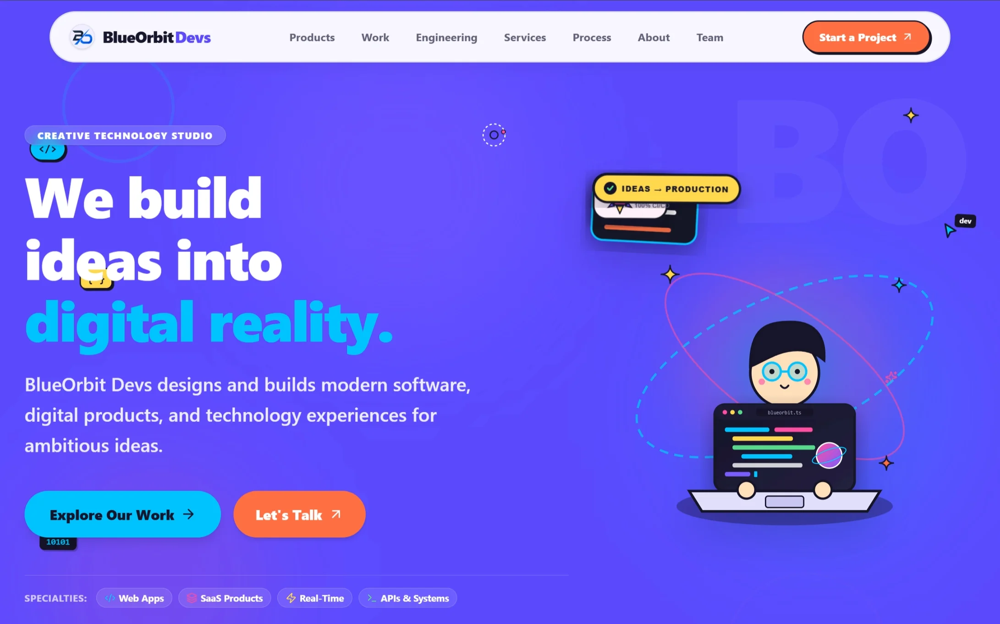

<p align="center">
  
</p>

<h1 align="center">
  BLUEORBIT DEVS
</h1>

<p align="center">
  <strong>A cinematic, modern, and interactive digital experience built for BlueOrbit Devs.</strong>
</p>

<p align="center">
  <a href="https://blueorbitdevs.org/">
    
  </a>
  
</p>

<p align="center">
  
  
  
  
  
  
</p>

---

# About

**BlueOrbit Devs** is a modern software development team focused on creating digital products, web applications, developer tools, and immersive user experiences.

This repository contains the source code for the official **BlueOrbit Devs** website.

The website is designed to communicate our work, products, services, engineering capabilities, development process, company story, and team through a modern interactive interface.

It is not intended to be a traditional static portfolio.

The experience combines:

* Modern UI/UX
* Motion and interaction
* Clean typography
* Responsive layouts
* Route-based navigation
* Interactive components
* Performance-focused development

---

# Experience

```text
                       BLUEORBIT DEVS

                            |
                            v

                       OUR WORK

                            |
                            v

                       PRODUCTS

                            |
                            v

                       SERVICES

                            |
                            v

                     ENGINEERING

                            |
                            v

                        PROCESS

                            |
                            v

                         ABOUT

                            |
                            v

                          TEAM

                            |
                            v

                     LET'S BUILD
```

---

# Features

* Modern cinematic UI
* Premium dark interface
* Fully responsive design
* Smooth page transitions
* Interactive animations
* Route-based navigation
* Clean URL structure
* Active navigation states
* Responsive mobile navigation
* Mobile hamburger menu
* Automatic mobile menu closing
* Work showcase
* Product showcase
* Services section
* Engineering section
* Development process
* About section
* Team section
* Contact functionality
* Custom 404 page
* Lucide/SVG based icons
* Optimized modern frontend architecture

---

# Navigation

The website uses clean route-based navigation.

Each major section has its own dedicated URL.

| Section     | Route          |
| ----------- | -------------- |
| Work        | `/work`        |
| Products    | `/products`    |
| Services    | `/services`    |
| Engineering | `/engineering` |
| Process     | `/process`     |
| About       | `/about`       |
| Team        | `/team`        |
| Contact     | `/contact`     |

The website does **not** use hash navigation such as:

```text
/#work
/#products
/#services
/#engineering
/#process
/#about
/#team
```

Instead, it uses clean URLs:

```text
/work
/products
/services
/engineering
/process
/about
/team
/contact
```

This allows:

* Browser Back/Forward navigation
* Direct URL access
* Shareable URLs
* Active route highlighting
* Better navigation structure
* Smooth transitions between pages

---

# Hero Actions

The main hero actions are connected to the appropriate routes.

```text
Explore Our Work
        |
        v
      /work
```

```text
Let's Talk
        |
        v
      /contact
```

```text
Start a Project
        |
        v
      /contact
```

---

# Responsive Design

BlueOrbit Devs is designed for different screen sizes and devices.

Supported layouts include:

* Desktop
* Laptop
* Tablet
* Mobile
* Small mobile devices

The navigation automatically switches to a mobile hamburger menu on smaller screens.

After selecting a navigation item on mobile, the menu closes automatically.

---

# Page Transitions

The website uses smooth transitions between routes to maintain a consistent cinematic experience.

Navigation should feel continuous rather than like a full page reload.

The existing visual language, animations, spacing, typography, and interaction patterns are preserved across routes.

---

# 404 Page

Unknown routes are handled by a custom 404 page.

For example:

```text
/random-page
```

will display the website's custom **404 / Not Found** experience.

The 404 page is intentionally preserved as part of the website experience.

---

# Preview

<p align="center">
  
</p>

---

# Live Website

<p align="center">
  <a href="https://blueorbitdevs.org/">
    
  </a>
</p>

<p align="center">
  <strong>https://blueorbitdevs.org/</strong>
</p>

---

# Installation

## Clone the Repository

```bash
git clone https://github.com/BlueOrbitDevs/website.git
```

## Enter the Project

```bash
cd website
```

## Install Dependencies

```bash
npm install
```

## Start Development Server

```bash
npm run dev
```

The application will be available at:

```text
http://localhost:3000
```

---

# Production

## Build

```bash
npm run build
```

## Start

```bash
npm start
```

---

# Project Structure

```text
website/
│
├── app/
│   ├── work/
│   ├── products/
│   ├── services/
│   ├── engineering/
│   ├── process/
│   ├── about/
│   ├── team/
│   ├── contact/
│   └── not-found.tsx
│
├── components/
│   ├── navbar/
│   ├── hero/
│   ├── sections/
│   ├── footer/
│   └── ui/
│
├── features/
│
├── lib/
│
├── public/
│   ├── banner.png
│   ├── screenshots/
│   └── assets/
│
├── components.json
├── eslint.config.mjs
├── next.config.ts
├── package.json
├── postcss.config.mjs
├── tsconfig.json
├── LICENSE
└── README.md
```

---

# Tech Stack

### Framework

**Next.js 16**

Used for the core application architecture, routing, rendering, and production optimization.

### Frontend

**React 19**

Used to build the interactive component system.

### Language

**TypeScript**

Provides type safety and a maintainable development experience.

### Styling

**Tailwind CSS**

Used for responsive layouts, utility styling, and the visual system.

### Animation

**Framer Motion**

Used for smooth transitions and interactive motion.

### Icons

**Lucide Icons**

Used for interface icons without relying on emoji-based UI elements.

### Development

**Turbopack**

Used for fast development builds and an improved development experience.

---

# Browser Support

| Browser         | Support |
| --------------- | :-----: |
| Chrome          |   Yes   |
| Edge            |   Yes   |
| Firefox         |   Yes   |
| Safari          |   Yes   |
| Brave           |   Yes   |
| Opera           |   Yes   |
| Mobile Browsers |   Yes   |

---

# Design Philosophy

A software company website should communicate more than what the company does.

It should communicate **how the company thinks**.

BlueOrbit Devs focuses on combining:

```text
Engineering
     +
Design
     +
Performance
     +
Creativity
     +
Experience
```

The goal is to create digital experiences that are:

* Fast
* Useful
* Reliable
* Beautiful
* Accessible
* Scalable
* Memorable

---

# Development Philosophy

We believe good software is built through a combination of strong engineering and thoughtful design.

Our approach focuses on:

### Clean Architecture

Build systems that are understandable, maintainable, and scalable.

### User Experience

Technology should make products easier and more enjoyable to use.

### Performance

Fast experiences are part of good design.

### Security

Applications should be developed with security and privacy in mind.

### Scalability

Products should be able to grow without unnecessary architectural complexity.

### Continuous Improvement

Every product can be improved through iteration, feedback, and experimentation.

---

# BlueOrbit Devs

<p align="center">
  <a href="https://blueorbitdevs.org/">
    
  </a>
</p>

---

# Proprietary Notice

This repository contains proprietary software and intellectual property belonging to **BlueOrbit Devs**.

The source code, UI/UX design, visual design, graphics, assets, branding, logos, written content, animations, and other materials contained in this repository are protected by applicable copyright laws.

Unless explicitly authorized in writing by **BlueOrbit Devs**, you may not:

* Copy the source code
* Reproduce the website
* Redistribute the source code
* Modify the source code
* Create derivative works
* Reuse the UI/UX design
* Reuse website assets
* Reuse the branding
* Publish modified versions
* Use the project in another website
* Use the project for personal projects
* Use the project for commercial purposes
* Claim any part of the project as your own

Viewing or accessing this repository does **not** grant permission to reuse its contents.

Any permitted use must be explicitly authorized in writing by **BlueOrbit Devs**.

---

# License

**Proprietary — All Rights Reserved**

Copyright © 2026 **BlueOrbit Devs**

This project is **not open source**.

No license is granted to copy, modify, distribute, reproduce, publish, or create derivative works from this project or its contents without prior written permission from BlueOrbit Devs.

See the [`LICENSE`](./LICENSE) file for the complete terms.

---

# Permissions

If you would like to use any part of this project, including:

* Source code
* Components
* UI design
* Animations
* Graphics
* Website structure
* Branding
* Assets

please contact **BlueOrbit Devs** for permission before using it.

Unauthorized usage is prohibited.

---

# Support

If you are interested in working with BlueOrbit Devs, building a product, or discussing a project, visit the official website:

<p align="center">
  <a href="https://blueorbitdevs.org/">
    <strong>blueorbitdevs.org</strong>
  </a>
</p>

---

<p align="center">

## "We don't just build software. We build experiences."

</p>

---

<p align="center">
  Built with passion by <strong>BlueOrbit Devs</strong>
</p>

<p align="center">
  <a href="https://blueorbitdevs.org/">
    blueorbitdevs.org
  </a>
</p>
